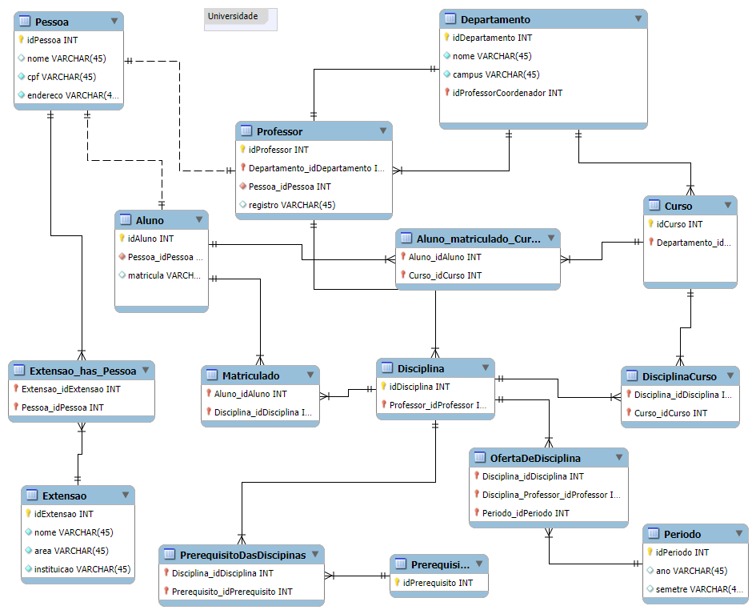

# Desafio Start Schema Universidade 

## Objetivo: 
Criar o diagrama dimensional – star schema – com base no diagrama relacional disponibilizado.

## Foco:
Professor – objeto de análise.

Vocês irão montar o esquema em estrela com o foco na análise dos dados dos professores. Sendo assim, a tabela fato deve refletir diversos dados sobre professor, cursos ministrados, departamento ao qual faz parte.

Por aí vocês já têm uma ideia do que deve compor a tabela fato do modelo em questão.

Obs.: Não é necessário refletir dados sobre os alunos!

## O que deve ser feito?
Deverá ser criada a tabela Fato que contêm o contexto analisado. Da mesma forma, é necessária a criação das tabelas dimensão que serão compostas pelos detalhes relacionados ao contexto.

Por fim, mas não menos importante, adicione uma tabela dimensão de datas. Para compensar a falta de dados de datas do modelo relacional, suponha que você tem acesso aos dados e crie os campos necessários para modelagem. 

Ex: data de oferta das disciplinas, data de oferta dos cursos, entre outros. O formato, ou melhor, a granularidade, não está fixada. Podem ser utilizados diferentes formatos que correspondem a diferentes níveis de granularidade.

DER - Universidade:


## Star Schema - Universidade:

1. Tabela Fato: FatoProfessor

Essa tabela centraliza a análise, armazenando métricas quantitativas relacionadas aos professores e suas atividades.

Colunas principais:

Chaves Estrangeiras:idProfessor (ligação com a dimensão DimProfessor)
idDisciplina (ligação com a dimensão DimenssaiDisciplina)
idDepartamento (ligação com DimenssaoDepartamento)
idCurso (ligação com DimenssaoCurso)
idPeriodo (ligação com a dimensão DimenssaoPeriodo)

Métricas:totalMatriculadosDisciplina (número total de alunos matriculados nas disciplinas do professor)
totalCargaHoraria (soma da carga horária ministrada)
numeroDisciplinasMinistradas (quantidade de disciplinas dadas pelo professor)
numeroCursosRelacionados (total de cursos nos quais o professor leciona)

2. Tabelas Dimensão

Essas tabelas fornecem descrições detalhadas dos objetos associados ao FatoProfessor.

2.1. Dimensão: DimenssaoProfessor

Atributos detalhados dos professores:

idProfessor (chave primária)
nomeProfessoe
registroProfessor
idDepartamento (relacionado ao departamento de vinculação)

2.2. Dimensão: DimenssaoDisciplina

Detalhes sobre as disciplinas:

idDisciplina (chave primária)
nomeDisciplina
descricao
cargaHoraria
idCurso (ligação com o curso da disciplina)

2.3. Dimensão: DimenssaoCurso

Detalhes sobre os cursos:

idCurso (chave primária)
nomeCurso
duracao
idDepartamento (ligação com o departamento)
campus

2.4. Dimensão: DimenssaoDepartamento

Informações sobre departamentos:

idDepartamento (chave primária)
nomeDepartamento
campus
idProfessorCoordenador (professor responsável pelo departamento)


2.5. Dimensão: DimenssaoPeriodo

Possibilita análises temporais (anual, semestral, etc.):

idPeriodo (chave primária)
ano
semestre
periodoCompleto (YYYY-S formato concatenado)


Star Schema - Universidade:


```
O projeto esta disponível no github: https://github.com/guilhermeheizer/DesafioStartSchemaUniversidade

```


## Autor

- [@guilhermeheizer](https://www.github.com/guilhermeheizer)


